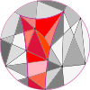

## About
Various (short) programs, common algorithms and similar crowd.

Made for different coding websites (checkio, codility, codewars...).
Also for courses or job interviews.
Or some nuggets from my coding history.

Intentionally somewhat obscured in order to make searching for direct solutions somewhat harder. Because of that I also didn't link to original source / creators / respective owner of the problem either.

Since I've spend non trivial amount of time on them, I want to have them out in the open.

## Licence
**Tl;dr: Learn from here, don't present materials as yours.**

Published under [MIT licence](LICENCE)

